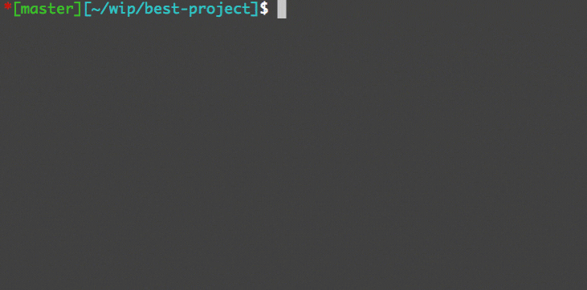

# Git Emoji Commit 📦

Simple CLI to encourage more concise commits.

## setup

- \$ `npm i -g git-emoji-commit`
- \$ `git-emoji-commit --help` to see options

## usages

- \$`gec` to start the commit prompts or
- \$`gec "YOUR COMMIT MESSAGE"` or
- \$`gec --[option] "YOUR COMMIT MESSAGE"`

## git-emoji-commit workflow

- \$`git add .`
- \$`gec "YOUR COMMIT MESSAGE"` to make a commit
- \$`git push`

## commit types

- `--feat` or `-f` to make a feature commit
- `--style` or `-s` to make a style commit
- `--fix` or `-x` to make a fix commit
- `--chore` or `-c` to make a chore commit
- `--doc` or `-d` to make a docs commit
- `--refactor` or `-r` to make a refactor commit
- `--content` or `-n` to make a content commit
- `--test` or `-t` to make a test commit
- `--try` or `-y` to make a try commit
- `--build` or `-b` to make a build commit

## details
- `--help` or `-h` to see options
- `--version` or `-V` to see version
